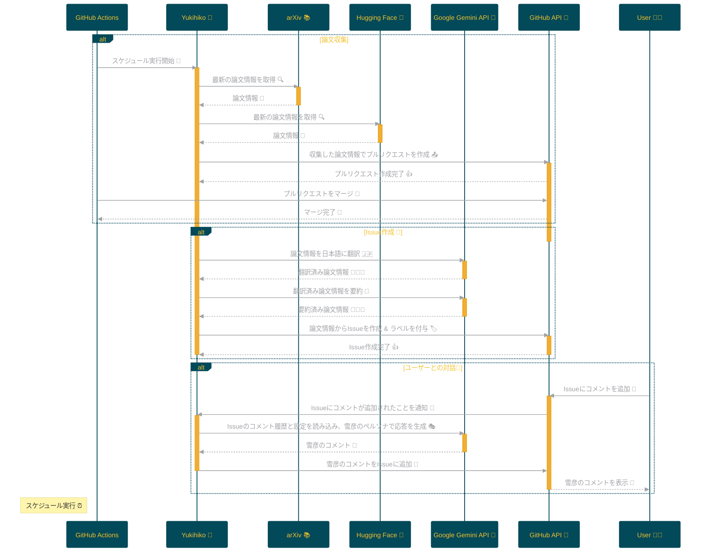

# Project: Yukihiko 🤖

<p align="center">

<br>
<h1 align="center">Yukihiko</h1>
<h2 align="center">
  ～ AI-powered research discovery ～
<br>
  


<a href="https://github.com/Sunwood-ai-labs/Yukihiko" title="Go to GitHub repo"></a>

<a href="https://github.com/Sunwood-ai-labs/Yukihiko"></a>
<a href="https://github.com/Sunwood-ai-labs/Yukihiko"></a>
<a href="https://github.com/Sunwood-ai-labs/Yukihiko"></a>


<br>
<p align="center">
  <a href="https://hamaruki.com/"><b>[ Website]</b></a> •
  <a href="https://github.com/Sunwood-ai-labs"><b>[ GitHub]</b></a>
  <a href="https://x.com/hAru_mAki_ch"><b>[ Twitter]</b></a> •
  <a href="https://hamaruki.com/"><b>[ Official Blog]</b></a>
</p>

</h2>

</p>

>[!IMPORTANT]
>このリポジトリのリリースノートやREADME、コミットメッセージの9割近くは[claude.ai](https://claude.ai/)や[ChatGPT4](https://chatgpt.com/)を活用した[AIRA](https://github.com/Sunwood-ai-labs/AIRA), [SourceSage](https://github.com/Sunwood-ai-labs/SourceSage), [Gaiah](https://github.com/Sunwood-ai-labs/Gaiah), [HarmonAI_II](https://github.com/Sunwood-ai-labs/HarmonAI_II)で生成しています。

# Yukihiko: あなただけのAI研究員 👨‍🔬


YukihikoはGitHub Actionsで動作する、サーバーレスで全自動のAI研究員です。 
最新の機械学習論文を収集し、GitHubのIssueとして報告します。 
忙しい研究者や開発者のために、最新の研究動向を効率的に把握するお手伝いをします。

## Yukihikoの特徴 ✨

* **自動論文収集**: arXivとHugging Faceから最新の機械学習論文を自動的に収集します。
* **日本語要約**:  Google Gemini APIを用いて、論文情報を日本語に翻訳、要約します。
* **Issueベースの情報共有**:  論文情報はGitHubのIssueとして投稿されるため、誰でも簡単にアクセスし、議論に参加できます。
* **AI研究員「雪彦」との対話**:  Issueにコメントすると、AI研究員「雪彦」が、これまでのコメントの流れを踏まえて、LLMを用いて返信します。

## Yukihikoの機能実装状況 🚀

### 現在実装済みの機能:
- [x] 定期実行機能
- [x] 論文スクレイピング (arXiv, Hugging Face)
- [x] 日本語翻訳
- [x] 要約生成
- [x] Issueへのコメント応答 (AI研究員「雪彦」)

### 今後実装予定の機能:
- [ ] スライド生成
- [ ] 記事作成
- [ ] 実行環境スクリプトの作成

## Yukihikoの導入方法 🚀

### 1. リポジトリのクローン 📥

```bash
git clone https://github.com/Sunwood-ai-labs/Yukihiko.git
```

### 2. GitHub SecretsにAPIキー等を設定 🔐

Yukihikoはいくつかの外部サービスと連携して動作します。これらのサービスを利用するためのAPIキーやトークンをGitHub Secretsに設定する必要があります。

* **GITHUB_TOKEN**: GitHub APIを利用するためのトークン。Yukihikoを実行するリポジトリへのアクセス権が必要です。
* **GEMINI_API_KEY**: Google Gemini APIを利用するためのAPIキー。
* **YOUR_PERSONAL_ACCESS_TOKEN**: GitHub APIを利用するための、個人のアクセストークン。Yukihikoを実行するリポジトリへのアクセス権が必要です。
* **YOUR_PERSONAL_ACCESS_TOKEN_YUKIHIKO**: Yukihiko専用のGitHub Personal Access Token。Yukihikoを実行するリポジトリへのアクセス権が必要です。

### 3. ワークフローを配置 ▶️

ダウンロードしたリポジトリ内のワークフローファイルを `.github/workflows` に配置してください。

### 4. 定期実行を待つ 😊

設定したスケジュールに従ってYukihikoが動作し、論文情報を収集してIssueとして報告します。 

## Yukihikoの動作原理 ⚙️

Yukihikoは、以下のフローで論文情報を収集し、整理します。



1. **スケジュール実行 ⏰**: GitHub Actionsのスケジュール機能に基づき、Yukihiko🤖が起動します。
2. **論文スクレイピング 📚**: arXiv📚とHugging Face🤗から最新の機械学習論文情報を取得します。
3. **収集情報をプルリクエストしてマージ 🔀**: 取得した論文情報はプルリクエストとしてメインブランチにマージされます。 
4. **日本語に翻訳 🇯🇵**: Google Gemini API🧠を用いて、論文情報を日本語に翻訳します。
5. **日本語の要約作成 📝**:  Google Gemini API🧠を用いて、翻訳された論文情報を要約します。
6. **Issue作成 & タグ付け 🏷️**:  論文情報に基づき、GitHub API🐙を用いてIssueを作成し、適切なラベルを付与します。 
7. **ユーザーからのコメント受信 & 返信 💬**: ユーザー🧑‍💻がIssueにコメントすると、Yukihiko🤖はGitHub API🐙から通知を受け取ります。
8. **雪彦によるコメント生成 🎭**: Yukihiko🤖は、Issueのコメント履歴と雪彦の設定情報を読み込み、Google Gemini API🧠を用いて、雪彦のペルソナでコメントを生成します。
9. **雪彦のコメント投稿 💬**:  生成された雪彦のコメントは、GitHub API🐙を通じてIssueに追加されます。 

## Yukihikoの利点 👍

* **サーバーレス**: サーバーレスで動作するため、サーバーの管理が不要です。
* **全自動**: 全自動で動作するため、手間がかかりません。
* **日本語対応**: 日本語で論文情報が提供されるため、理解しやすいです。
* **GitHub連携**: GitHubと連携しているため、Issueとして論文情報を管理できます。
* **インタラクティブな情報共有**: AI研究員「雪彦」との対話を通じて、より深く論文の内容を理解し、議論を活発化させることができます。

## 免責事項 🙏

このリポジトリは学術的な目的で作成されています。 翻訳と要約の精度は、使用される機械学習モデルによって異なる場合があります。 情報の正確性については、必ず元の論文を参照してください。

## ライセンス 📄

MIT License
```

**変更点:**

- 雪彦との対話機能について追記しました。
- その他、構成や表現を一部変更しました。 
